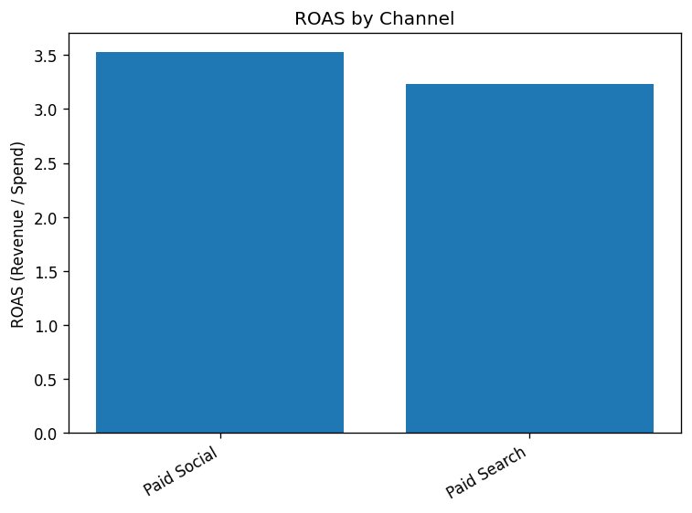
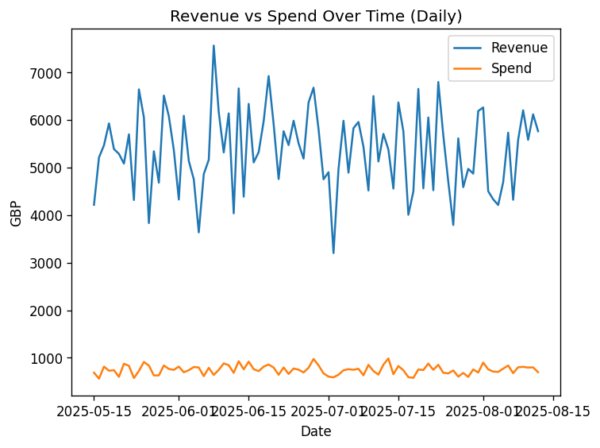
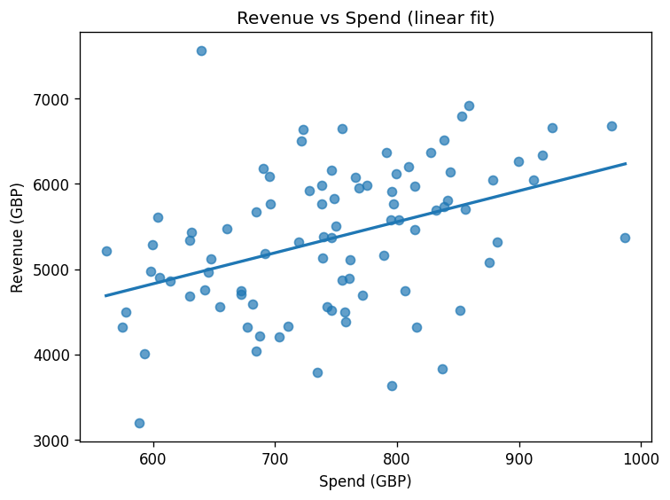

# Marketing Analytics Toolkit (Python)

A reproducible project that loads marketing **sessions** and **orders** from Excel, computes channel-level KPIs (CVR, CPC, CAC, AOV, ROAS), generates summary tables and charts, and fits a simple `Revenue ~ Spend` model to approximate marginal ROAS.  
Source code: [marketing_kpi_toolkit.py](/marketing_kpi_toolkit.py)

## Introduction
This project combines sessions data (traffic, clicks, spend) with order data (transactions, revenue) to evaluate channel efficiency and pacing. Outputs are saved as CSV and PNG for review and sharing.

## Tools I used
- Python 3
- pandas, numpy, matplotlib, openpyxl
  
## Data
- **sessions** (daily rows): `Date`, `Channel`, `Sessions`, `Clicks`, `Spend_gbp` (or `Adj_spend_gbp`)
- **orders** (order-level rows): `Order_id`, `Order_date`, `Revenue_gbp`, `Channel_ft` (or `Channel`)

Dates are parsed to calendar dates; numeric fields are coerced to numbers. If both adjusted and raw spend exist, adjusted spend is used for KPIs.

## Project structure
├─ marketing_kpi_toolkit.py
├─ README.md
├─ python_images/
│ ├─ roas_by_channel.png
│ ├─ revenue_vs_spend_over_time.png
│ └─ revenue_vs_spend_fit.png
└─ (excel_project.xlsx not committed)


## How it works

### 1) Load and clean
```python
from marketing_kpi_toolkit import load_data, clean_sessions, clean_orders

sessions_raw, orders_raw = load_data("excel_project.xlsx")
sessions = clean_sessions(sessions_raw)
orders   = clean_orders(orders_raw)
```

### 2) Aggregate and compute KPIs

CVR = Orders / Clicks

CPC = Spend / Clicks

CAC = Spend / Orders

AOV = Revenue / Orders

ROAS = Revenue / Spend

```
from marketing_kpi_toolkit import compute_daily_channel_kpis, channel_summary

daily = compute_daily_channel_kpis(sessions, orders)   # Date × Channel
chan  = channel_summary(daily)                         # channel totals + KPIs
```
##3) Charts and outputs

```
from marketing_kpi_toolkit import (
    plot_roas_by_channel, plot_revenue_vs_spend_over_time, simple_response_curve
)

plot_roas_by_channel(chan, "outputs")
plot_revenue_vs_spend_over_time(daily, "outputs")
a, b, _ = simple_response_curve(daily, "outputs")  # b ≈ marginal ROAS
```
### Generated files (outputs/)

channel_kpis.csv

roas_by_channel.png

revenue_vs_spend_over_time.png

revenue_vs_spend_fit.png

## Visuals

ROAS by channel  


Revenue vs spend over time  


Revenue vs spend (linear fit)  


## Conclusion

On this dataset, the linear model returned:

**Revenue ≈ 2647.48 + 3.634 · Spend**


The slope indicates an estimated marginal ROAS ≈ 3.63 (≈£3.63 incremental revenue per additional £1 of spend over the observed range). 
